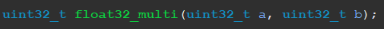
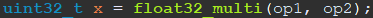

# Single-Precision-Floating-Point-IEEE-754-values-multiplication-ARM-algorithm
The function returns a result of a multiplication of two single precision floating point number (IEEE 754). For now the function does not support denormalized numbers so the minimal number is 2^(-126). Usage of denormalized numbers will be avaible in the future.  The function has been created using ARMv7 instructions and for Thumb mode. In the case of "NaN" value the funtion returns " NaN" value. In the case of multiplying inf * 0 the result is NaN.
To use the function in your code you have to:
1) Add the file to your workspace:

2) Write the prototype of the function (I use uint32_t as a type of returning values because I need to do some logical operations on the results. This is still the same value, but compiler allows me to do some logic operations):

3) Use the function in code:

 
